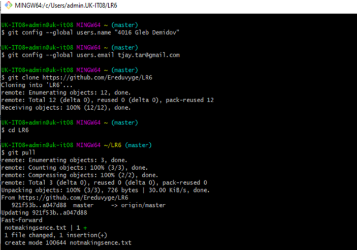
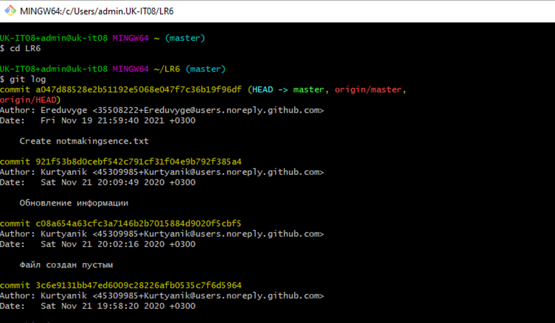
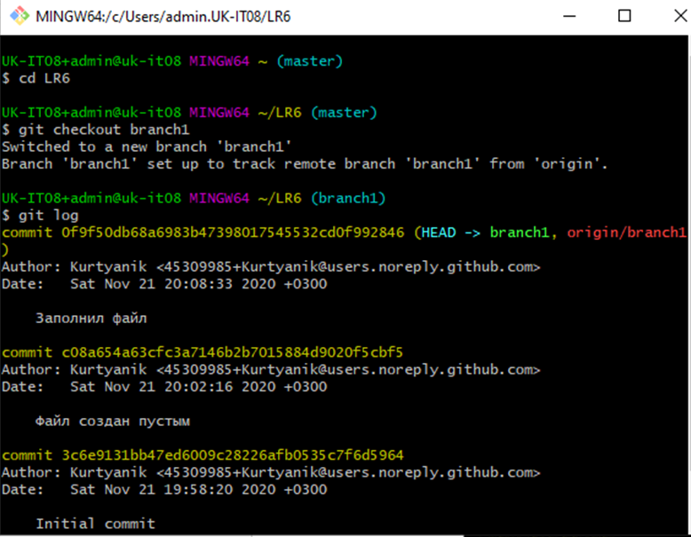
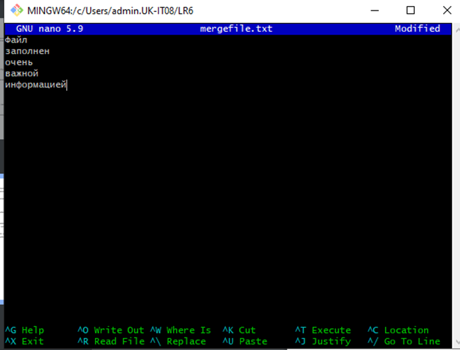
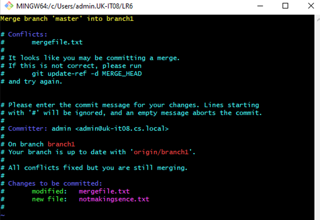
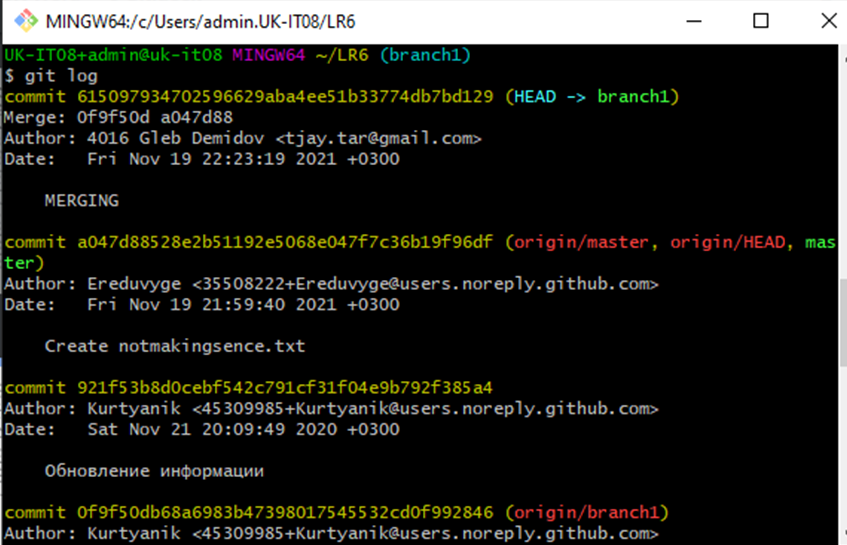
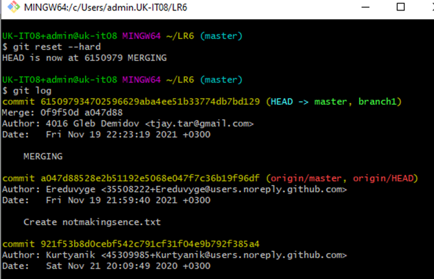
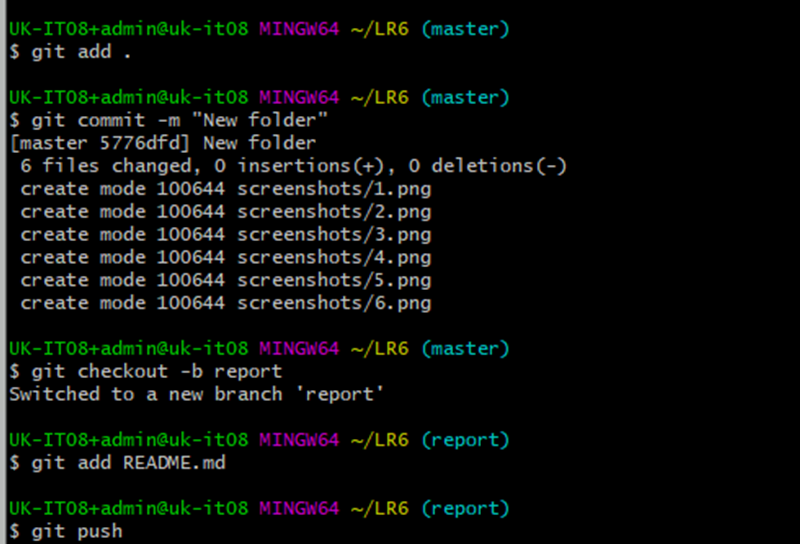
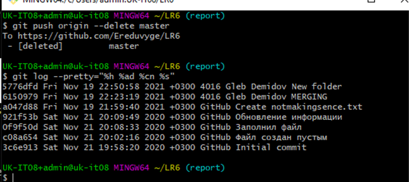

# LR6
Лабораторная работа №6
#### Ход работы
Логин в аккаунт гитхаб. После этого установка гит и клонирование репозитория:
Настройка Git параметрами `git config --global user.name <username>` и `git config --global user.email <email>`.
Затем с помощью `git clone <url>` загрузил репозиторий.
После этого добавил в репозиторий файл "notmakingsence.txt" и с помощью `git pull` загрузил

Далее с помощью команда `git log` запрашиваем историю изменений ветки, а с помощью `git checkout <name>` переключаемся между ветками

Далее пытаемся объеденить ветки masters и branch1 командой `git merge branch1`. Получаем ошибку и решаем с помощью  `nano <name`>, затем `git add <name>` и `git commit`

Затем был произведене хард откат `git reset --hard <name>`

Далее создал папку "Screenshots", которую поместил несколько скриншотов и добавил их в репозиторий, после чего сделал коммит и загрузил все на github

После чего создал ветку report и файл "README.md", удалил ветку мастер и запросил логи в кратком формате

Закончил отчет и загрузил обновил репозиторий на Github.
